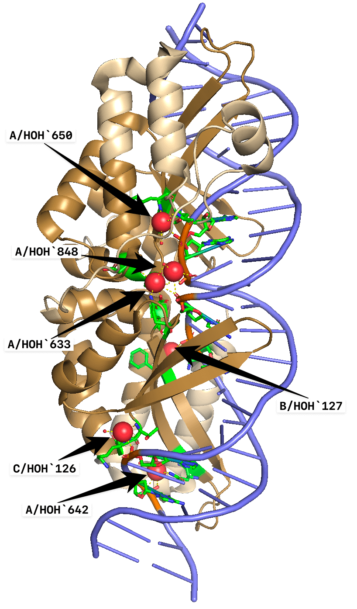
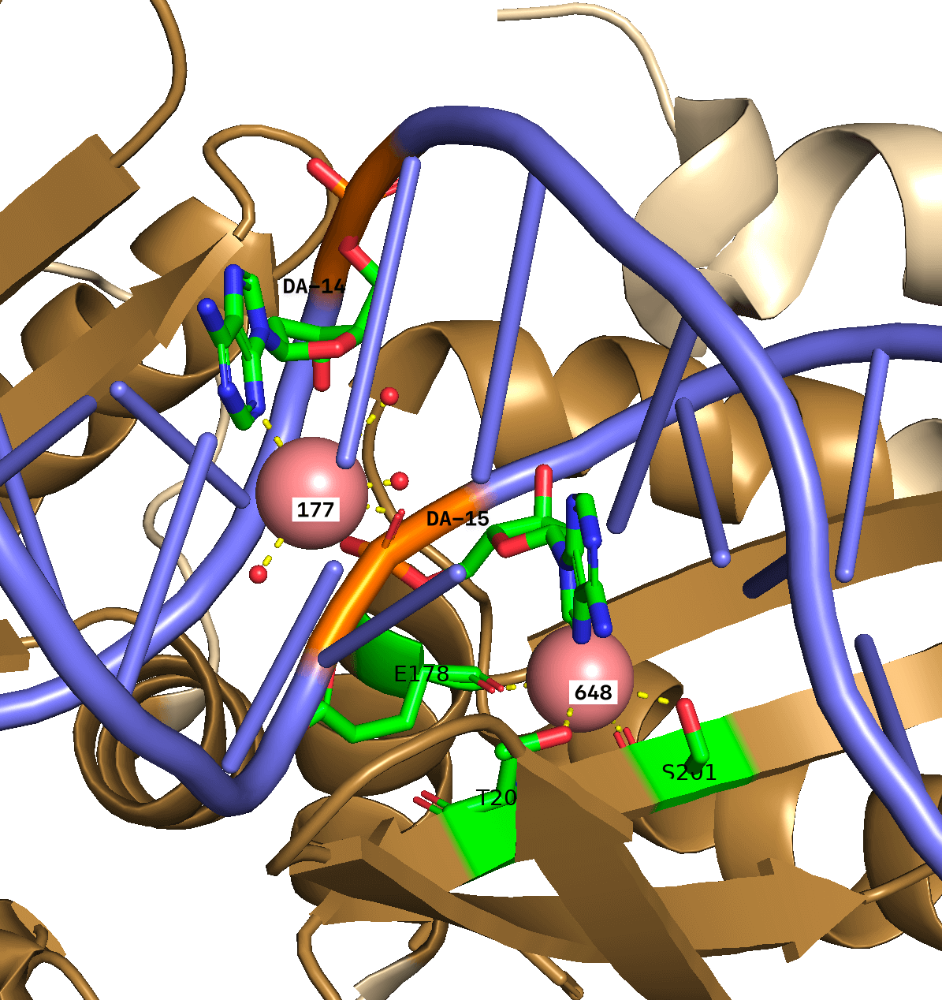

# Консервативные молекулы воды в структурах ДНК-белковых комплексов
## Conserved water molecules in structures of DNA-protein complexes

<br>

Порядок работы с плагином ProBis H2O


<br>

Пример результатов для семейства `LAGLIDADG_1` (структура 6BD0).

| Наиболее консервативные молекулы воды на ДНК-белковом интерфейсе  | Молекула воды C/HOH`177 (розовая сфера), вероятно, играет важную структурную роль в ДНК-белковом комплексе |
| ------------- | ------------- |
|   |         |


## Дерево файлов

```
├── README.md
├── assets
│   ├── pic_1.png
│   ├── pic_2.png
│   └── pic_3.png
├── database
│   ├── ProtAC_PDB.csv
│   ├── domain_coords_chains.csv
│   ├── families_prots_pdbs_amount.csv
│   ├── final-db.dump
│   ├── input
│   │   ├── dan_proteins_raw.csv
│   │   └── pdbmap
│   ├── pdb_resolution_water.csv
│   ├── queries.sql
│   └── readme.md
├── pdb
│   ├── 1AIS.cif
│   ├── ....
│   └── 7CSY.pdb
├── probisH2O
│   └── ProBiS_H2O_plugin.py
├── probisH2O-logs
│   ├── probis_py.log
│   ├── probis_py_HTH_3.log
│   ├── probis_py_LAGLIDADG_1_1T9I.log
│   ├── probis_py_LAGLIDADG_1_6BCE.log
│   ├── probis_py_LAGLIDADG_1_6BD0.log
│   ├── probis_py_LAGLIDADG_3.log
│   ├── probis_py_P53.log
│   └── probis_py_TBP.log
├── reports
│   ├── report_HTH_3.csv
│   ├── report_LAGLIDADG_1_1T9I.csv
│   ├── report_LAGLIDADG_1_6BCE.csv
│   ├── report_LAGLIDADG_1_6BD0.csv
│   ├── report_LAGLIDADG_3.csv
│   ├── report_P53.csv
│   └── report_TBP.csv
└── scripts-src
    ├── interface.ipynb
    ├── lib
    │   ├── emoji_list.py
    │   ├── pdb_line_parser.py
    │   └── utils.py
    ├── readme.md
    ├── run_all_reports_from_bash.sh
    ├── script_report.py
    └── test
```
